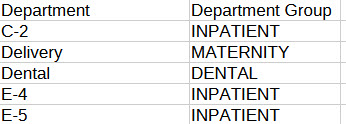

< [Portfolio](https://907sjl.github.io) | [Full Report](https://907sjl.github.io/pdf/Operations%20Daily%20View.pdf) | [PBIX File on GitHub](https://github.com/907sjl/operations-daily-view/blob/main/Operations%20Daily%20View.pbix) | [Overview](https://907sjl.github.io/operations-daily-view/operations_report)    

"Operational" dashboards surface high-level measures that allow executive leaders to monitor 
the running status of the business or organization, to ask timely questions of the business managers, and to make 
decisions that optimize their business. Operational dashboards communicate what is important to an organization, and 
take different forms depending on what is important or timely.    

This report is an example of my previous work to create an operational dashboard for a hospital. The specific content 
was decided upon by conducting interviews to discuss current needs and solicit requirements.    

## Why Power BI? 
Why would I choose Power BI to create this report? The cloud-hosted platform for Power BI provides many conveniences that 
allowed me to publish an operations report to an executive audience. These conveniences consist of a portal site that 
is accessible with common browsers, workspace organization for content, access controls that integrate with Active Directory, 
a data refresh scheduler, and notifications. Power BI supports a mobile-friendly format if that is also a requirement.    

The reports are both quick to manipulate in a WYSIWYG editor and page formatted. The combination of Power Query M Scripts 
and DAX measure calculations makes Power BI extremely nimble, as does the visual design interface for building reports. 
There is a plethora of community support and freely accessible training for those who are new to Power BI. A dashboard 
created in Power BI can also function as a page formatted report. If you are faced with a typical business intelligence, 
rapid and iterative prototyping scenario where exploratory analysis is refined into repeatable process measurement then 
Power BI is a good choice.    

## Overview
Click [here](https://907sjl.github.io/operations-daily-view/operations_report) for an overview of the report. All data 
in this report is fabricated and does not represent any real healthcare organization. The example provided is loaded 
with data from a collection of CSV files.    

## Data sources 
For the purposes of demonstration this example report loads data from Comma Separated Values files.    

- Census Day.csv
: A file containing one row for each patient day, defined as a patient occupying a bed at midnight.    

- Census Discharge.csv
: A file containing one row for each discharged patient.    

- Department.csv
: A reference listing of department names loaded into a dimension table.    

- ED Visit.csv
: A file containing one row for each patient who presents to emergency services.    

- Index Encounter.csv
: A file containing one row for each inpatient or emergency services encounter included in the denominator of readmission rates.    

- Medical Service.csv
: A reference listing of medical service categories loaded into a dimension table.    

- Surgical Service.csv
: A file containing one row for each surgery case scheduled into an operating room.    

- Report Calendar.csv
: Contains the data for the standard date dimension table used across reports.     

## Power Query ELT
    
Three custom groups organize the Power Query loads and transforms.    

### Parameters and Functions
    
A parameter is used to locate the folder where Power Query can find the CSV files.    

    
The **data_folder** parameter provides a single, convenient location to set the directory where the report can find the data files to load. The *Source* step of 
each source table references this parameter.    

### Data Loads
    
The Data Loads group contains the loads of source data files that were extracted from the SQL data warehouse. In actual practice, 
these loads would also perform the extract using a connection to the SQL database. For this example the data has been 
fabricated in CSV files.    

### Census Day Table 
    
This source file for the **Census Day** table contains a table representing the dates that each patient encounter occupied an inpatient bed at midnight. 
The sum of patient days over a period is the numerator of the average length of stay measure.    

### Census Discharge Table 
    
This source file for the **Census Discharge** table contains a table representing patient discharges. The count of discharges over a period is the denominator 
of the average length of stay measure. The associated Geometric Mean Length of Stay (GMLOS) is included as a column. This 
column represents the average length of stay for the same Diagnosis Related Group (DRG) as calculated by CMS.    

### ED Visit Table 
    
This source file for the **ED Visit** table contains a table representing patients who present to emergency services. Metrics for emergency services 
include time to see a physician and the time required for the physician to reach a disposition. Columns with these timings 
are included that, in practice, are extracted from the SQL data warehouse. Also included is a column indicating if the 
patient left the emergency area before being seen.    

### Index Encounter Table 
    
This source file for the **Index Encounter** table contains a table representing encounters that are members of a CMS readmission cohort. An indicator column 
contains either 1 or 0 if the encounter has a readmission within 30 days of discharge. In practice this indicator is extracted 
from the SQL data warehouse. Also included is a column that groups encounters into category bins by their primary diagnosis.    

### Surgical Service Table 
    
This source file for the **Surgical Service** table contains a table representing surgical cases that are scheduled into an 
operating room. Many columns are included that allow DAX measures and Power BI visuals to calculate measures for surgical 
service operations. Some of these columns identify cases as members of the first case on time start denominator, for example, 
and others are timings that can be summarized into average and total turnaround times. In practice these columns are extracted 
from the SQL data warehouse.    

### Dimension Tables 
    
The queries in the Dimensions group fill tables representing the pivotal dimensions for reporting. These tables can be related to multiple other tables that contain 
facts used in measures. They can also contain attributes used to sort or filter dimension values in visualizations by something other than the dimension name.    

### Department Table 
    
This source file contains a table representing hospital location mappings to departmental groupings for reports. The locations 
and departments are loaded into the **Department** dimension table.    

### Medical Service Table 
    
This source file contains a table representing medical service categories for reports. The medical services are loaded into 
the **Medical Service** dimension table.    

### Report Calendar Table 
    
The query for the **Report Calendar** table loads records of calendar dates and their pivotal attributes. These records are 
used to create the date dimension for the report. This dimension can play different roles in the data model by 
associating it with different date attributes in DAX measures.   

## Power BI Data Model 
<a href="images/data_model.jpg"></a> 
Being a compilation of data from many sources, this data model imports tables covering multiple subjects and departments from the enterprise data warehouse. 
A calendar table and two, pivotal shared dimension tables are related to tables that have fact values and local dimension columns. The measures are organized 
into the subject area table that best applies.        

## Power BI Report

In the scenario where this report is used we hosted the report within an executive reporting workspace in the Power BI cloud service. Customers were subscribed to 
a Power BI application.  They receive notifications upon refresh and a link to view the report online. We intended this report to be a surface level summary of 
operational processes and outcomes of current interest to executive leaders. The report inspired timely questions for further research and analysis.        

Click [here](https://907sjl.github.io/operations-daily-view/operations_report) for an overview of the report. The following sections describe the DAX measures behind 
some of the visualizations.    

### Total Patient Days    
    

**Total Patient Days** is both the numerator of the **Average Length of Stay** measure and a metric that appears separately in this report. The core measure calculates 
the sum of census days from all source data included in its current context. The report calculates this measure across different periods by layering measures with time intelligence filters on top of 
the measure that performs the core calculation.    
```
Total Patient Days = SUM('Census Day'[# Census Days])

MTD Patient Days = 
  CALCULATE([Total Patient Days]
            , DATESBETWEEN('Report Calendar'[Date]
                           , [Curr Month Start Date]
                           , [Last Data Date]))

Prev MTD Patient Days = 
  CALCULATE([Total Patient Days]
             , DATESBETWEEN('Report Calendar'[Date]
                            , [Prev Month Start Date]
                            , [Prev MTD Data Date]))
```    
Each of the period specific calculations create a filtered context of calendar dates from which to calculate the 
patient days. Each period specific measure follows the same pattern of using **DATESBETWEEN** to filter the date dimension table using bookend dates 
that are returned from measures. The date measures calculate the correct start and end dates for each period from the top-level page context. I've found 
this to be a terse and reliable way to code different periods into measures.    

```
Avg Total Patient Days Per Month = 
  AVERAGEX(DISTINCT('Report Calendar'[Year Month #]), [Total Patient Days])

Full12 Avg Total Patient Days Per Month = 
  CALCULATE([Avg Total Patient Days Per Month]
            , DATESBETWEEN('Report Calendar'[Date]
            , [Full12 Start Date]
            , [End of Last Month]))
```    
The 12-Month period is calculated as the average monthly total over the twelve month period. This is accomplished by using **AVERAGEX** over distinct 
year-month combinations to calculate the total patient days for each and then average the resulting totals. Then a second measure applies a time filter 
to calculate this average over a specific twelve month period.    

### Average Length of Stay    
    

Average length of stay, in this report, is calculated using the commonly used quality measure methodology that divides the number of patient days in the period by the number of 
discharges in the period. The patients discharged need not be the same as the patients with counted days. This is an easy metric to calculate on a rolling basis.    
```
Total Patient Days = SUM('Census Day'[# Census Days])

Count Discharges = DISTINCTCOUNTNOBLANK('Census Discharge'[EncounterID])

Avg Length of Stay = DIVIDE([Total Patient Days], [Count Discharges])

MTD Avg Length of Stay = 
  CALCULATE([Avg Length of Stay]
            , DATESBETWEEN('Report Calendar'[Date]
            , [Curr Month Start Date]
            , [Last Data Date]))

Prev MTD Avg Length of Stay = 
  CALCULATE([Avg Length of Stay]
            , DATESBETWEEN('Report Calendar'[Date]
            , [Prev Month Start Date]
            , [Prev MTD Data Date]))

Mov364 Avg Length of Stay = 
  CALCULATE([Avg Length of Stay]
  , DATESBETWEEN('Report Calendar'[Date]
  , [Mov364 Start Date]
  , [Last Data Date]))
```    
This measure follows the same pattern of layers of period specific measures over core calculation measures. The core calculation is separated into layers to 
calculate a ratio of two standalone metrics.    

### Period Date Measures    
In the pattern described above there are specific measures for the starting and ending dates of each period. These measures calculate specific dates 
from the top-level page context of the report.    
```
Curr Month Start Date = EOMONTH([Last Data Date], -1) + 1

Prev Month Start Date = EOMONTH([Last Data Date], -2) + 1

Full12 Start Date = EOMONTH([Last Data Date], -13) + 1

Mov364 Start Date = [Last Data Date] - 363

Last Data Date = MAX('Report Calendar'[Date]) - 1
```    
The **EOMONTH** function is handy for calculating single date values to bookend periods that are denominated in months. The return values can be used as 
parameters to the **DATESBETWEEN** function to filter the data context within the scope of a **CALCULATE** function.    

### Comparable Geometric Mean Length of Stay (GMLOS)    
    

Geometric Mean Length of Stay values are calculated by the Centers for Medicare & Medicaid Services (CMS). CMS uses claims data to calculate the geometric 
mean of the length of patient stays by diagnosis related group (DRG). The GMLOS values for each DRG are made available and are included in the data warehouse 
that feeds this report.    

The **Comparable GMLOS** metric in this report is the average GMLOS value for every encounter that was discharged in the period. Encounters are assigned a 
GMLOS value according to their DRG.    

```
Avg GMLOS = AVERAGE('Census Discharge'[CMS GMLOS])
```    
There is a similar build-up of layered measures on top of this one that filter the data context for individual periods following the same pattern as described 
above for **Total Patient Days**.    

### Average Length of Stay Index (LOSI)    
    

The **Average LOSI** metric is the **Average Length of Stay** for a period divided by the **Comparable GMLOS** for the same period. It is a ratio of our 
length of stay over the CMS benchmark length of stay for the same DRGs.    

```
Avg LOSI = DIVIDE([Avg Length of Stay], [Avg GMLOS])
```    
There is a similar build-up of layered measures on top of this one that filter the data context for individual periods following the same pattern as described 
above for **Total Patient Days**.    

### Average Opportunity Days    
    

**Opportunity Days** are simply the **Comparable GMLOS** values subtracted from the **Average Length of Stay** values for any given pivotal dimension. It represents, 
on average, the number of days that our length of stay exceeds the CMS benchmark for the same DRGs. This can be caused by more difficult case mixes than the 
benchmark and does not mean that patients stay longer than they should. This metric is meant to inspire questions and a deeper look when needed.    

```
Mov364 Avg Opportunity Days = 
  IF(NOT(ISBLANK([Mov364 Avg GMLOS]))
     , MAX([Mov364 Avg Length of Stay] - [Mov364 Avg GMLOS]
     , 0))
```    
In this case the measure is only calculated over a rolling 12-month period. More samples are better for this metric. The measure must also handle the scenario 
where the current context does not include any associated GMLOS values. This measure can produce a negative result and that should be handled appropriately in 
the visual.        

### Readmission Rate 
    
Hospital or emergency services encounters are considered *index admissions* if the reason for visit falls into one of the standard *cohort* definitions according 
to the Centers for Medicare and Medicaid Services (CMS). An index admission is also a readmission in this data model if the same patient was admitted to a 
hospital or presented to emergency services again, unplanned, within 30 days of their discharge from the index admission encounter.

```
Count Index Admissions = 
  sum('Index Encounter'[Index Admission Yn])

Count Readmissions = 
  sum('Index Encounter'[Readmission Yn])

Rate of Readmission = 
  DIVIDE([Count Readmissions]
         , [Count Index Admissions])
```    
The core calculation of the **Readmission Rate** is a ratio of the number of index encounters that are readmissions over the number of index encounters. 
Two layers of DAX measures calculate this rate over all index encounters in the current data context. The index encounters are imported from the data 
warehouse. Within the data warehouse, the index encounters are tagged as either a readmission or not by setting an indicator column to either 1 or 0. This 
indicator column can be conveniently summed in DAX measures to calculate the numerator.    

    
This report displays moving window rates in a line chart. Moving rates are helpful to smooth performance measures where the denominator's volume 
varies over time and the numerator is dependent upon case-by-case circumstances. The moving rate includes more data than a single month, week, or day but 
still adjusts day-to-day based on recent outcomes. 

``` 
Mov364 Rate of Readmission = 
  CALCULATE([Rate of Readmission]
            , DATESBETWEEN('Report Calendar'[Date]
                           , [Mov364 Start Date Delayed 91d]
                           , [Last Data Date Delayed 91d]))

Mov91 Rate of Readmission = 
  CALCULATE([Rate of Readmission]
            , DATESBETWEEN('Report Calendar'[Date]
                           , [Mov91 Start Date Delayed 91d]
                           , [Last Data Date Delayed 91d]))
```    
The moving rate is calculated using the same pattern of measures as in the **Total Patient Days** metric described above. Measures filter the **Report Calendar** 
table to only those dates in the period and then call the core calculation measure to calculate the readmission rate for those dates. When placed in a line chart 
with a calendar date axis these measures create a moving rate chart. Each axis value creates a distinct calculation with a different date context.    

```
Mov364 Rate of Readmission Hospital-Wide = 
  CALCULATE([Mov364 Rate of Readmission]
            , KEEPFILTERS('Index Encounter'[Cohort] = "Hospital Wide"))
```    
The cohort name is a pivotal dimension on the Index Encounter table, and so calculating a readmission rate for a single cohort is a simple filter on this column. 
This is done in a separate measure that calls the moving rate calculation for the desired period with a data context filtered to just the one cohort.    

```
Mov364 Start Date Delayed 91d = [Last Data Date] - 363 - 91

Last Data Date Delayed 91d = MAX('Report Calendar'[Date]) - 91
```    
In our scenario the coding delay is estimated to be three months. Identifying index encounters and unplanned admissions requires diagnosis codes. To account 
for the coding delay, the measures that calculate the period dates also move the start and end dates for each period back 91 days. The specific number of days 
in each period is purposeful to include the same number of Sundays in every calculation. Sunday is typically a day with the least volume. Including a different 
number of Sundays in each period can create jitter in the data and partially skew comparisons.    

### First Case On-Time Starts    
    
When an operating room has a full schedule, starting the first case of the day for that room late affects the schedule for the rest of the day. The first case 
can have a negative impact on multiple patients. The **First Case On-Time Starts** metric calculates the percentage of first cases that started on-time each 
day across all operating rooms.    

```
Count First Cases = 
  SUM('Surgical Service'[First Scheduled Case Yn])

Count First Cases On Time = 
  SUM('Surgical Service'[First Case On Time Start Yn])

Count First Cases Delayed = 
  [Count First Cases] - [Count First Cases On Time]

Count Rooms Without First Case = 
  [Count Rooms Scheduled] - [Count First Cases]

Count Rooms Scheduled = 
  /* SUMX allows the scheduled rooms for more than one day to be counted */ 
  SUMX('Report Calendar'
       , CALCULATE(DISTINCTCOUNTNOBLANK('Surgical Service'[Start Room])
       , KEEPFILTERS('Surgical Service'[OR Closed Yn]=0)))
```    
A surgical case need only ever be evaluated as on-time or not just once and so that calculation happens in the data warehouse. This report loads the 
on-time status with the Surgical Service table data. The status is an indicator column that contains either 1 or 0. The indicator column can be summed 
to calculate the number of on-time cases.    

Operating rooms can be excluded from the calculation for special circumstances or if the first case of the day is later in the day. The **Count Rooms Scheduled** 
measure is used to count all operating rooms that were used at least once each day in order to calculate how many of those were excluded from having a countable 
first case.    

### Average Turnover Time
    
Between cases, operating rooms are cleaned and prepped for the next case. The time required to do this affects the operating room schedule for the rest of the day. 
Much like a first case on-time start, the turnover time can impact multiple patients. **Average Turnover Time** is the average of the recorded turnover times 
between surgical cases for the period.       

```
Avg Turnover Time = 
  CALCULATE(AVERAGE('Surgical Service'[Room Turnover Minutes])
            , KEEPFILTERS('Surgical Service'[Room Turnover Included Yn] = 1))
```    
Turnover times between cases can be excluded for special circumstances or if the turnover time exceeds the limit to be considered an outlier. An indicator column 
in the data warehouse identifies turnover times that should be included in the average. Turnover minutes are loaded with the Surgical Services table data. The times 
are calculated once in the data warehouse for every case that follows another case in the same operating room.    

### Total Delay Minutes
    
**Delay Minutes** is the number of minutes between when the case was scheduled to start and when the patient was actually wheeled-in to the operating room. 
This report surfaces the average of the total delay minutes per day over different periods.    

```
Total Delay Minutes = 
  SUM('Surgical Service'[Delay Minutes])

Avg Total Delay Minutes Per Day = 
  CALCULATE(AVERAGEX('Report Calendar', [Total Delay Minutes])
            , KEEPFILTERS('Report Calendar'[Is Weekend Yn] = 0)
            , KEEPFILTERS('Report Calendar'[Is Holiday Yn] = 0))
```    
Delay minutes are calculated in the data warehouse once for each surgical case. They are loaded into this report with the Surgical Services table data. 
**AVERAGEX** calculates daily totals and then averages those daily totals for a daily average. This report excludes holidays and weekends from the 
metric using indicator columns on the Report Calendar table.    

### Scheduled Minutes Used
    
If surgical cases overrun their scheduled time that also impacts the schedule for the rest of the day. If surgical cases consistently under-run their scheduled time 
then valuable operating room time could be going to waste. **Scheduled Minutes Used** is the ratio of minutes with a patient in the room over the number of minutes 
scheduled.    

```
Ratio of Scheduled Room Minutes Used = 
  DIVIDE(sum('Surgical Service'[In Room Minutes])
         , sum('Surgical Service'[Scheduled OR Minutes]))
```    
The minutes scheduled and the minutes with a patient in the room are calculated in the data warehouse once for every surgical case.    

### ED Arrivals
    
Encounters to emergency services are loaded with the ED Visits table data. This report displays metrics and visuals with the number 
of visits per month for different periods.    

```
Count ED Arrivals = DISTINCTCOUNTNOBLANK('ED Visit'[EncounterID])

Avg Count ED Arrivals Per Month = 
  AVERAGEX(DISTINCT('Report Calendar'[Year Month #])
           , [Count ED Arrivals])
```    
These core measures calculate the number of emergency services arrivals over a period and the average number of visits per month. 
**AVERAGEX** totals the visits by month using a list of distinct year-month values, then averages those totals across the months 
in the current data context. Additional measures create a filtered context of dates for various periods using the same pattern as 
for the **Total Patient Days** measure.    

### Left Without Being Seen %
    
The **Left Without Being Seen %** (LWBS) measure tracks the number of patients leave the emergency services department 
before they can be seen by a provider relative to the overall number of emergency services visits. A higher LWBS can be a leading 
indicator of poor patient satisfaction or a symptom that emergency services are not accessible enough.    

```
Count LWBS = sum('ED Visit'[LWBS Yn])

Rate ED LWBS = DIVIDE([Count LWBS], [Count ED Arrivals])
```    
The Left Without Being Seen status is identified in the source eMR system and loaded into this report from the data warehouse. 
This measure builds upon the ED Arrivals measure to create an overall rate of LWBS patients.    

### Door To Doc Time
    
The median time between patient arrivals to emergency services and their evaluation by physicians is surfaced as the 
**Door to Doc Time** metric. The median is calculated over different time periods. This report also includes the 
daily median and IQR for the current month plotted as a stacked area chart.    

```
Median Minutes Arrive to Eval = 
  MEDIAN('ED Visit'[Minutes Arrival to Evaluation])

Q1 Minutes Arrive to Eval = 
  PERCENTILE.INC('ED Visit'[Minutes Arrival to Evaluation], 0.25)

Q1 to Q2 Minutes Arrive to Eval = 
  [Median Minutes Arrive to Eval] - [Q1 Minutes Arrive to Eval]
  
Q3 Minutes Arrive to Eval = 
  PERCENTILE.INC('ED Visit'[Minutes Arrival to Evaluation], 0.75)
  
Q2 to Q3 Minutes Arrive to Eval = 
  [Q3 Minutes Arrive to Eval] - [Median Minutes Arrive to Eval]
```    
These measures create the stacking effect in the visual by calculating the delta between 1st, 2nd, and 3rd quartiles in order to 
stack areas so that the visual properly represents the IQR range. The chart with dates on the x-axis calculates these measures for 
each day in the current month. The minutes between arrival and evaluation are calculated in the data warehouse for each 
individual emergency services encounter.    

### Doc To Disposition Time
    
The median time between physician evaluations and the resulting dispositions is surfaced as the **Doc to Disposition Time** metric. 
The median is calculated over different time periods. This report also includes the daily median and IQR for the current month 
plotted as a stacked area chart. Patients are either admitted to an inpatient bed from the ER or they are discharged. The 
time of this decision is referred to as the time to disposition.    

```
Median Minutes Exam to Disposition = 
  MEDIAN('ED Visit'[Minutes Exam to Disposition])

Q1 Minutes Exam to Disposition = 
  PERCENTILE.INC('ED Visit'[Minutes Exam to Disposition], 0.25)

Q1 to Q2 Minutes Exam to Disposition = 
  [Median Minutes Exam to Disposition] - [Q1 Minutes Exam to Disposition]
  
Q3 Minutes Exam to Disposition = 
  PERCENTILE.INC('ED Visit'[Minutes Exam to Disposition], 0.75)
  
Q2 to Q3 Minutes Exam to Disposition = 
  [Q3 Minutes Exam to Disposition] - [Median Minutes Exam to Disposition]
```    
These measures create the stacking effect in the visual using the same pattern as the **Door to Doc Time** measure described 
above.  The minutes between evaluation and disposition are calculated in the data warehouse for each individual emergency services 
encounter.    

### Total Hold Minutes
    
Patients who are to be admitted to an inpatient bed are placed on-hold if a bed is not immediately ready for them in the correct 
ward. **Total Hold Minutes** tracks the total time that patients spend on-hold in emergency services waiting for a bed. Sometimes 
patients will spend multiple nights in emergency services and so the time on-hold can be more than a day for one patient.    

```
Total Hold Minutes = 
  CALCULATE(SUM('ED Visit'[Minutes Hold to Exit])
            , KEEPFILTERS('ED Visit'[Hold Yn] = 1))
  
Avg Total Hold Minutes Per Month = 
  AVERAGEX(DISTINCT('Report Calendar'[Year Month #])
           , [Total Hold Minutes])
```    
These core measures calculate the total number of minutes on-hold across all patients based on the encounters included in the 
current data context. This report filters emergency services visits by arrival date. This can create somewhat of a retroactive 
update when patients spend multiple nights in emergency services.    

**AVERAGEX** totals the minutes by month of arrival using a list of distinct year-month values, then averages those totals across 
the months in the current data context. Additional measures create a filtered context of dates for various periods using the same 
pattern used for the **Total Patient Days** measure.    

### Display Folders for Data Elements
    
This report resulted in a large collection of measures, across multiple subjects, with different inclusion criteria that build 
upon one another. These measures are organized into display folders within the tables for each subject area. One folder per 
metric with multiple measures in each folder.    

< [Portfolio](https://907sjl.github.io) | [Full Report](https://907sjl.github.io/pdf/Operations%20Daily%20View.pdf) | [PBIX File on GitHub](https://github.com/907sjl/operations-daily-view/blob/main/Operations%20Daily%20View.pbix) | [Overview](https://907sjl.github.io/operations-daily-view/operations_report)    

<p style="font-size:11px">Page template forked from <a href="https://github.com/evanca/quick-portfolio">evanca</a></p>
<!-- Remove above link if you don't want to attibute -->
